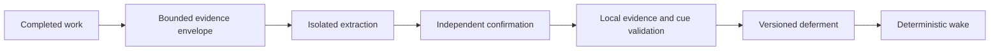

<p align="center">
  
</p>

<h1 align="center">Now We Can (NWC)</h1>

<p align="center"><strong>Bring blocked work back exactly when it becomes possible.</strong></p>

<p align="center">
  <a href="#quick-install-with-your-agent">Quick Install</a> |
  <a href="#getting-started">Getting Started</a> |
  <a href="#the-deferment-model">Deferments</a> |
  <a href="#integrations">Integrations</a> |
  <a href="#benchmarks">Benchmarks</a> |
  <a href="ARCHITECTURE.md">Architecture</a>
</p>

<p align="center">
  <a href="https://github.com/lucasrgt/now-we-can/actions/workflows/ci.yml"></a>
  <a href="https://github.com/lucasrgt/now-we-can/releases"></a>
  <a href="LICENSE"></a>
  
  
</p>

Coding agents routinely finish a task with legitimate future work: remove a
fallback after a migration, adopt an API when it ships, or begin the next phase
after an acceptance gate passes. That intention usually disappears with the
session or becomes an unactionable TODO.

Now We Can captures only **evidence-backed conditional deferments**, versions
them with the repository, and delivers them when their exact machine-checkable
cue becomes true. Due work cannot silently disappear behind context
compaction, a different agent, or a later task.

```text
Completed work contains a proven deferment -> nwc collect
A task or external event begins            -> nwc wake
The deferred action is completed           -> nwc resolve
Work is about to finish                    -> nwc check
```

<table>
<tr><td><b>One durable concept</b></td><td>A deferment records one concrete future action, its current blocker, an observable cue, reusable scope, and verbatim evidence.</td></tr>
<tr><td><b>Automatic capture</b></td><td>Two isolated judge passes must return the same evidence-bounded candidate. There is deliberately no manual <code>nwc add</code>.</td></tr>
<tr><td><b>Deterministic waking</b></td><td>Events, path presence or absence, and literal file-content conditions are evaluated without a model.</td></tr>
<tr><td><b>Repository-owned memory</b></td><td>Readable TOML deferments travel through Git with the team. No hosted service or daemon owns the truth.</td></tr>
<tr><td><b>Harness-owned delivery</b></td><td>The skill and managed instructions tell any host when to collect, wake, resolve, and check. Delivery does not depend on agent memory.</td></tr>
<tr><td><b>Agent and language independent</b></td><td>Any Git codebase and any shell or MCP-capable agent can use the same native binary.</td></tr>
</table>

Now We Can is prospective repository memory. It answers one durable
question:

> Which previously blocked action can proceed now?

---

## Quick install with your agent

Copy this prompt into any coding agent with terminal access:

```text
Set up Now We Can in this Git repository.

Download the latest stable binary for this machine from
https://github.com/lucasrgt/now-we-can/releases and verify its published
SHA256SUMS entry. Use no third-party package and do not build from source.

Install `nwc` in a user-local PATH location without administrator access or
adding runtime dependencies to the repository. Confirm with `nwc --version`.

At the repository root, run `nwc init --agent-file AGENTS.md`. If CLAUDE.md,
GEMINI.md, or another tracked agent instruction file is actively used, pass
one additional `--agent-file` option for each applicable file. Preserve all
existing content.

Read `.nwc/SKILL.md`. Confirm that `.nwc/deferments/` and `.nwc/SKILL.md` are
versioned while `.nwc/config.local.toml` is ignored. Keep the default local
Codex judge when Codex is available. Otherwise configure the local judge
command for the available noninteractive model CLI. Never commit credentials
or personal judge configuration.

Run `nwc wake`, then `nwc check`. Do not create deferments manually and do not
collect setup prose as future work.

Do not commit, push, or modify unrelated files. Report the installed version,
changed files, active judge command, migration performed if any, and any
action still required.
```

### Manual installation

Linux and macOS:

```bash
curl -fsSL https://raw.githubusercontent.com/lucasrgt/now-we-can/main/scripts/install.sh | sh
```

Windows PowerShell:

```powershell
irm https://raw.githubusercontent.com/lucasrgt/now-we-can/main/scripts/install.ps1 | iex
```

Build from source:

```bash
cargo install --git https://github.com/lucasrgt/now-we-can --locked
```

Now We Can is one native binary. It requires no hosted service, daemon, Node runtime,
Python runtime, or project-language integration.

---

## Getting started

Initialize a Git repository and connect the portable skill to the instruction
files its agents actually read:

```bash
nwc init \
  --agent-file AGENTS.md \
  --agent-file CLAUDE.md
```

At task completion, the harness supplies the task, selected plan, final
response, and current diff:

```bash
nwc collect \
  --task "Migrate customer writes while mobile v1 remains active" \
  --plan ROADMAP.md \
  --final-message .agent-last.md
```

If the evidence proves that cleanup must wait for a stable external condition,
Now We Can records the deferment. When the host later observes that condition:

```bash
nwc wake --event mobile-v1-retired
```

The due action returns with its original blocker, evidence, scope, and cue.
After completing the work:

```bash
nwc resolve \
  --id 01k... \
  --evidence "commit abc123 and AVP customer-write verdict"

nwc check --event mobile-v1-retired
```

### The harness lifecycle

| Moment | Command | Result |
| --- | --- | --- |
| Task start | `nwc wake` with every currently observed event | Due obligations enter context before editing |
| New external event | `nwc wake --event <stable-name>` | Event-backed deferments become actionable |
| Context reset or compaction | Rerun `nwc wake` | Due work survives the lost conversation |
| Deferred action completed | `nwc resolve --id <id> --evidence "<proof>"` | The original record remains with resolution evidence |
| Task completion | `nwc collect --task ... --plan ... --final-message ...` | Newly proven conditional work is captured |
| Pre-commit, review, or pre-push | `nwc check` with the same observed events | Completion stops while due work remains unresolved |

`wake` and `check` are intentionally repeatable. The host should invoke them
again whenever events, repository state, task scope, or context changes.

### Exit codes

| Code | CLI meaning | Required action |
| --- | --- | --- |
| `0` | The operation completed and no supplied or repository cue leaves due unresolved work | Continue |
| `1` | `check` found at least one due unresolved deferment | Complete or explicitly resolve the obligation, then rerun |
| `2` | Repository, storage, configuration, judge, protocol, or output failure | Treat the operation as incomplete |

Judge and storage failures do not become successful CLI checks.

---

## The deferment model

A deferment is not a reminder. It is a conditional obligation backed by
evidence from completed work.

```toml
schema = 1
id = "01k..."
title = "Remove the LegacyName dual-write"
action = "Remove the old DTO field, write path, and database column."
blocker = "Mobile v1 still reads LegacyName."
scopes = ["src/customers/**"]
evidence = [
  "mobile v1 still reads LegacyName",
  "customer.LegacyName = input.Name"
]
recorded_at = "2026-07-26T12:00:00Z"
recorded_by = "Ana Developer"
recorded_commit = "9e8d..."

[cue]
kind = "event"
path = ""
value = "mobile-v1-retired"
```

A valid deferment answers five questions:

| Question | Field |
| --- | --- |
| What concrete work will become required? | `action` |
| Why is it intentionally impossible or incorrect now? | `blocker` |
| What exact observation makes it actionable? | `cue` |
| Where does the obligation apply? | `scopes` |
| Which completed-work artifact proves the claim? | `evidence` |

### What belongs in a deferment

| Record | Reject |
| --- | --- |
| Remove compatibility code after a named client version retires | Finish work omitted from the current task |
| Adopt an official API after its tracked module or event exists | A vague aspiration such as "improve this later" |
| Begin the next phase after a stable acceptance event passes | Optional polish with no real blocker |
| Delete a fallback when a named file no longer contains the legacy contract | Permanent behavior disguised as temporary work |
| A concrete action with two verbatim evidence fragments | An invented path, event, blocker, or prerequisite |

Now We Can must never launder incomplete current scope into a future roadmap.

---

## Deterministic cues

Waking does not call a model. Each active deferment has one exact cue:

| Cue kind | Becomes due when | Required fields |
| --- | --- | --- |
| `event` | The host supplies the exact stable event name | `value` |
| `path_exists` | A repository-relative path exists | `path` |
| `path_absent` | A repository-relative path no longer exists | `path` |
| `file_contains` | A repository text file contains the literal value | `path`, `value` |
| `file_not_contains` | An existing repository text file no longer contains the literal value | `path`, `value` |

`file_not_contains` requires the file to exist. A missing or unreadable file
cannot create a vacuous pass.

Events are supplied by the host, which makes Now We Can composable with CI, release
automation, GitHub, deployment systems, AVP verdicts, feature-flag retirement,
or any other source capable of emitting a stable name:

```bash
nwc wake \
  --event avp:customer-write:passed \
  --event deployment:mobile-v1:retired
```

---

## Automatic collection

There is deliberately no `nwc add`. Capture belongs to the harness, not to an
agent remembering to maintain another memory tool.



The collection envelope contains only:

- the current task;
- selected plan or roadmap text;
- the final agent response;
- the Git diff, including untracked text files;
- first-pass candidates during confirmation.

Internal `.nwc/**` files are always excluded from the diff. Prior deferments,
local judge files, and Now We Can's own instructions cannot prove a new candidate.

The first isolated pass proposes at most 20 deferments. Local validation
requires:

1. non-empty title, action, and blocker;
2. at least one valid reusable glob scope;
3. at least two evidence fragments copied verbatim from the envelope;
4. one structurally valid deterministic cue;
5. repository-confined paths.

The second isolated pass receives the same envelope and first-pass candidates.
Only structurally identical candidates survive. Existing active
action, blocker, and cue triples are deduplicated.

### Deterministic capture bounds, probabilistic extraction

| Deterministic Now We Can guarantee | Model-dependent judgment |
| --- | --- |
| Bound the collection envelope and candidate count | Decide whether the prose describes a legitimate conditional deferment |
| Require two matching isolated passes | Interpret whether the blocker is real and the action is concrete |
| Verify evidence as verbatim envelope substrings | Separate intentional deferment from optional polish |
| Validate cue shape, scopes, and repository-relative paths | Choose the most faithful cue described by the evidence |
| Deduplicate active action, blocker, and cue triples | Express a concise reusable action and blocker |

Now We Can constrains model judgment. It does not replace model intelligence.

---

## Repository storage and configuration

`nwc init` creates:

```text
.nwc/
  config.local.toml
  SKILL.md
  deferments/
    <ulid>.toml
```

Commit `.nwc/SKILL.md` and `.nwc/deferments/` so every clone receives the same
protocol and obligations. `.nwc/config.local.toml` remains ignored because the
judge executable and local environment belong to each developer or harness.

Optional team configuration may live at `.nwc/config.toml`. Configuration is
resolved in this order:

1. `.nwc/config.local.toml`;
2. `.nwc/config.toml`;
3. the user configuration directory at `now-we-can/config.toml`.

The judge command reads one prompt from standard input and must emit strict
JSON on standard output:

```toml
schema = 1

[judge]
command = [
  "codex",
  "exec",
  "--ignore-user-config",
  "--ignore-rules",
  "--ephemeral",
  "--skip-git-repo-check",
  "--sandbox",
  "read-only",
  "-"
]
```

TOML deferments are the durable source of truth. Now We Can does not require SQLite or
another generated index to wake them.

---

## Integrations

### CLI

The CLI is the universal surface for shell-capable agents, hooks, CI, and local
development:

```bash
nwc wake --json
nwc check --json
```

`--json` keeps standard output machine-readable for orchestration.

### MCP

Start the local stdio server:

```bash
nwc mcp
```

A typical MCP host entry is:

```json
{
  "mcpServers": {
    "now-we-can": {
      "command": "nwc",
      "args": ["mcp"]
    }
  }
}
```

The server exposes the same core operations:

| MCP tool | Purpose |
| --- | --- |
| `nwc_collect` | Collect evidence-backed deferments from completed work |
| `nwc_wake` | Return active deferments whose cues are currently true |
| `nwc_resolve` | Record completion and resolution evidence |
| `nwc_check` | Return the current due-work result for host enforcement |

### Portable skill

`.nwc/SKILL.md` defines the lifecycle independently of any one agent vendor.
Managed instruction blocks can be installed into `AGENTS.md`, `CLAUDE.md`,
`GEMINI.md`, or another repository instruction file:

```bash
nwc init \
  --agent-file AGENTS.md \
  --agent-file CLAUDE.md \
  --agent-file GEMINI.md
```

Initialization is idempotent and preserves human-authored content.

### The AeroFortress foundation

The projects remain independent and composable:

| Project | Durable question |
| --- | --- |
| Now We Can | Which previously blocked action can proceed now? |
| [Right This Way](https://github.com/lucasrgt/right-this-way) | How does this repository already implement this correctly? |
| [Not You Again](https://github.com/lucasrgt/not-you-again) | Which corrected failure must not recur? |
| [Acceptance Verification Protocol](https://github.com/lucasrgt/acceptance-verification-protocol) | Which acceptance behavior must hold? |

An AVP verdict can arrive as a Now We Can event and wake the next roadmap phase. RTW
can supply the positive precedent, NYA can supply relevant scars, and AVP can
prove the completed behavior. No library requires another to function.

---

## Benchmarks

The published v0.1.0 evidence was recorded under the former Not Yet name. The
raw artifacts remain unchanged so the results stay auditable.

| Suite | Result | Measured evidence |
| --- | --- | --- |
| [Genesis capture](genesis/) | PASS | 4/4 positives, 4/4 negatives, and 4/4 exact cues with Codex |
| [Paired agent](benchmarks/results/v0.1.0-paired-gpt-5.3-codex-spark/REPORT.md) | PASS | 5/5 observed baseline misses became passing deferment-aware arms |
| [1,024-deferment stress](benchmarks/results/v0.1.0-stress-1024/REPORT.md) | PASS | 128/128 exact event probes plus all five cue kinds |
| [10,000-deferment stress](benchmarks/results/v0.1.0-stress-10000/REPORT.md) | PASS | 64/64 exact event probes plus corruption and fail-closed checks |

The 10,000-item Windows run measured an 80.937 second cold first wake, followed
by 0.703 second p50, 0.797 second p95, and 0.875 second maximum warm wakes. The
cold result remains published rather than being discarded.

These suites prove bounded extraction feasibility, observed paired delivery,
and deterministic large-corpus retrieval under the disclosed fixtures. They do
not claim a universal prevention or capture rate.

Reproduction commands, raw events, diffs, summaries, and limitations live in
[`benchmarks/`](benchmarks/).

---

## Product boundaries

Now We Can is deliberately narrow:

| Now We Can is | Now We Can is not |
| --- | --- |
| Repository-local prospective memory | A generic memory database |
| Conditional activation of proven future work | A scheduler or cron service |
| Evidence-backed deferment capture | A TODO or issue tracker |
| Deterministic cue evaluation | Semantic prediction of future events |
| A host-enforced agent protocol | An autonomous executor |
| A companion to roadmaps and acceptance systems | A roadmap generator |

Its complete mental model is an `if` statement that survives sessions:

```text
if observable_cue_is_true:
    deliver_evidence_backed_deferment
```

---

## Architecture and development

Read [ARCHITECTURE.md](ARCHITECTURE.md) for the storage, collection, waking,
surface, and product-boundary design.

The repository uses one canonical quality gate:

```bash
cargo install cargo-llvm-cov tokei --locked
cargo xtask verify
```

It enforces:

| Gate | Contract |
| --- | --- |
| Production Rust | At most 500 code lines under `src/` |
| Shared runtime coverage | At least 95 percent line coverage without rounding |
| Static quality | Formatting and Clippy with warnings denied |
| Behavior | Complete workspace tests |
| Distribution | Packaged entrypoint smoke |

CI and release call the same command.

---

## Migrating from Wake Me When 0.2 or Not Yet 0.1

The first `nwc init` automatically:

1. renames `.wmw/` or `.notyet/` to `.nwc/` when the destination does not exist;
2. preserves every versioned deferment;
3. replaces `wmw` or `notyet` managed instruction blocks in place;
4. installs the current skill and local configuration if missing.

Replace the `wmw` executable with `nwc`. MCP hosts must update tool names
from `wmw_*` or `notyet_*` to `nwc_*`. The old executable and MCP names
are deliberately not retained as aliases, so the product has one unmistakable
identity.

---

## License

Now We Can is available under the [MIT License](LICENSE).
